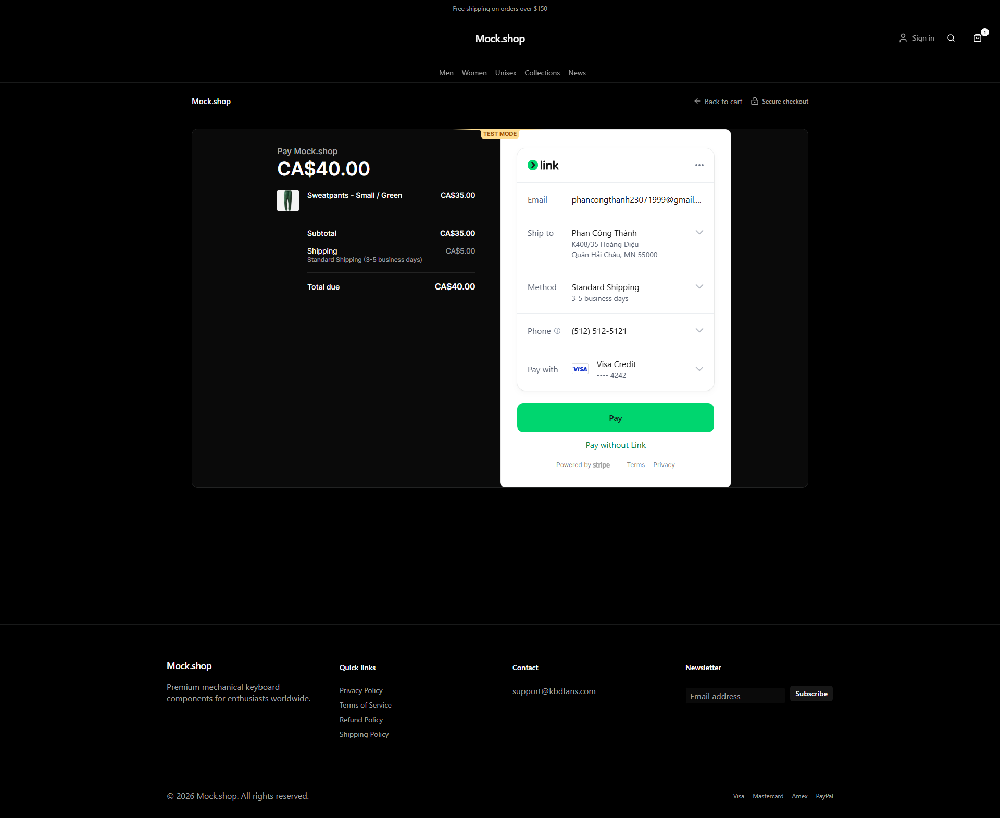

# Hydrogen Headless Storefront

A high-performance, modern headless Shopify storefront built with **React Router 7**, **Hydrogen**, **Tailwind CSS v4**, and **Stripe Embedded Checkout**.

This template is a production-ready "Skeleton" designed to be the ultimate starting point for bespoke Shopify storefronts. It prioritizes **Sub-second performance**, **Developer experience**, and **Accessibility** out of the box. Unlike traditional setups, it moves away from legacy Remix patterns in favor of the unified React Router 7 architecture, providing a more streamlined and powerful foundation for headless commerce.


## Features

- **React Router 7**: The successor to Remix, offering high-performance SSR, streaming, and a unified development model.
- **Hydrogen 2026.4.3**: Shopify's official toolkit, optimized for the Storefront API and global edge delivery.
- **Tailwind CSS v4**: A revolutionary, CSS-first engine that's faster and more capable, featuring built-in container queries and a modern configuration syntax.
- **Shadcn UI**: A collection of beautifully designed, accessible, and fully customizable components built on top of Radix UI primitives.
- **Stripe Embedded Checkout**: Custom checkout flow powered by Stripe's Embedded Checkout, replacing the default Shopify checkout redirect.
- **pnpm & Vite 8**: Blazing fast dependency management and HMR (Hot Module Replacement) for a frictionless developer workflow.
- **Oxygen & MiniOxygen**: Seamless local development and global deployment on Shopify's edge hosting platform.
- **Vercel Deployment**: Ready for production deployment on Vercel with edge runtime support.

## Folder Structure

```text
├── app/                  # Main application source
│   ├── components/       # Reusable UI components
│   │   └── ui/           # Shadcn UI (accessible primitives)
│   ├── graphql/          # Storefront API queries and fragments
│   ├── lib/              # Core business logic and shared utilities
│   ├── routes/           # File-based routing (React Router 7)
│   ├── styles/           # Global CSS and Tailwind design tokens
│   ├── root.tsx          # Root layout and application entry
│   └── entry.server.tsx  # Server-side entry point
├── public/               # Static assets (images, fonts, etc.)
├── server.ts             # Oxygen/MiniOxygen server entry
├── vite.config.ts        # Vite build and plugin configuration
└── package.json          # Project dependencies and scripts
```

## Quick Start

Get your development environment up and running in less than 5 minutes.

**Requirements:**
- Node.js `^22` or `^24`
- [pnpm](https://pnpm.io/) `^9`

```bash
# Install dependencies
pnpm install

# Start local development server
pnpm dev
```

## Deployment

### Vercel (Recommended)

This template can be deployed to Vercel with edge runtime support:

```bash
# Install Vercel CLI
pnpm add -g vercel

# Deploy to Vercel
vercel
```

### Shopify Oxygen

For deployment to Shopify's Oxygen edge hosting platform:

## Configuration

The project uses environment variables for configuration. Create a `.env` file based on `.env.example`.

| Variable | Description |
|----------|-------------|
| `SESSION_SECRET` | Secret key for session encryption |
| `PUBLIC_STOREFRONT_API_TOKEN` | Public access token for the Storefront API |
| `PRIVATE_STOREFRONT_API_TOKEN` | Private access token (required for server-side requests) |
| `PUBLIC_STORE_DOMAIN` | Your Shopify store domain (e.g., `store.myshopify.com`) |
| `PUBLIC_CHECKOUT_DOMAIN` | Domain used for the Shopify checkout/cart handoff |
| `PUBLIC_CUSTOMER_ACCOUNT_API_CLIENT_ID` | Client ID for the Customer Account API |
| `PUBLIC_CUSTOMER_ACCOUNT_API_URL` | Customer Account API URL |
| `PRIVATE_ADMIN_ACCESS_TOKEN` | Admin API access token (used for order/checkout lookups) |
| `PRIVATE_ADMIN_API_KEY` | Admin API key |
| `PRIVATE_ADMIN_API_SECRET_KEY` | Admin API secret key |
| `PRIVATE_ADMIN_API_VERSION` | Admin API version to target |
| `SHOP_ID` | Shopify shop ID |
| `STRIPE_SECRET_KEY` | Stripe secret key used server-side to create Embedded Checkout sessions |
| `STRIPE_PUBLIC_KEY` | Stripe publishable key used by the client to render Embedded Checkout |

## Stripe Integration

This storefront includes a complete **Stripe Embedded Checkout** integration that provides a custom payment experience without redirecting to the default Shopify checkout.



### Setup

1. **Create a Stripe Account**: If you haven't already, sign up at [stripe.com](https://stripe.com).

2. **Get Your API Keys**:
   - Log in to your Stripe Dashboard
   - Navigate to **Developers** → **API keys**
   - Copy your **Publishable key** and **Secret key**

3. **Configure Environment Variables**:
   ```env
   STRIPE_PUBLIC_KEY=pk_test_xxxxx  # Your publishable key
   STRIPE_SECRET_KEY=sk_test_xxxxx  # Your secret key
   ```

### How It Works

The Stripe integration uses **Embedded Checkout**, which allows you to embed the full checkout experience directly on your site without redirects.

- **Checkout Route** (`/checkout`): Creates a Stripe Checkout session server-side, passing your cart data and returning a `clientSecret` to the browser
- **Embedded Checkout Component** (`StripeEmbeddedCheckout`): Renders the Stripe checkout UI using the client secret
- **Return Handler** (`/checkout/return`): Handles post-payment flow and order confirmation
- **Success Page** (`/checkout/success`): Displays confirmation after successful payment

### Checkout Flow

1. Customer adds items to cart and clicks "Checkout"
2. Cart data is sent to the `/checkout` route
3. Server creates a Stripe Checkout Session with:
   - **Line items** from your cart (product name, price, image, quantity)
   - **Shipping options** (Standard, Express, Overnight)
   - **Allowed shipping countries** (US, CA, GB, AU, NZ, DE, FR, ES, IT, NL, IE, SG, JP)
   - **Branding** (colors, font, store name)
   - **Return URL** for post-payment redirect
4. Client renders the embedded checkout form
5. Customer completes payment with Stripe
6. Stripe redirects to your return URL with a `session_id`
7. Session is verified and order is created

### Customization

#### Shipping Options
Edit `app/lib/checkout.server.ts` to customize shipping rates:

```typescript
const SHIPPING_RATES = [
  {name: 'Standard Shipping', amount: 5, minDays: 3, maxDays: 5},
  {name: 'Express Shipping', amount: 15, minDays: 1, maxDays: 2},
  {name: 'Overnight Shipping', amount: 30, minDays: 1, maxDays: 1},
] as const;
```

#### Shipping Countries
Modify the `SHIPPING_ALLOWED_COUNTRIES` array to match your actual shipping zones:

```typescript
const SHIPPING_ALLOWED_COUNTRIES = ['US', 'CA', 'GB', ...];
```

### Currency Handling

The integration automatically handles zero-decimal currencies (JPY, KRW, etc.) by converting amounts appropriately. Prices are pulled directly from your Shopify cart and converted to Stripe's expected format.

### Testing

Use Stripe's test card numbers to test the checkout flow:
- **Card**: `4242 4242 4242 4242`
- **Expiry**: Any future date
- **CVC**: Any 3-digit number

### Troubleshooting

- **"Stripe is not configured"**: Ensure both `STRIPE_PUBLIC_KEY` and `STRIPE_SECRET_KEY` are set in your environment variables
- **"Stripe did not return a client secret"**: Check that your Stripe API keys are correct and valid
- **Branding settings rejected**: Stripe may reject certain branding parameters; the integration automatically retries without branding if this occurs

## Development Commands

| Command | Description |
|---------|-------------|
| `pnpm dev` | Starts the development server with automatic codegen |
| `pnpm build` | Compiles the application for production |
| `pnpm preview` | Boots a local production preview environment |
| `pnpm codegen` | Synchronizes GraphQL types from your `.graphql` files |
| `pnpm lint` | Performs static analysis for code quality |
| `pnpm typecheck` | Validates TypeScript types across the project |

## Documentation

- [Hydrogen Docs](https://shopify.dev/custom-storefronts/hydrogen)
- [React Router Docs](https://reactrouter.com/)
- [Tailwind CSS v4 Docs](https://tailwindcss.com/docs/v4-beta)
- [Shadcn UI Docs](https://ui.shadcn.com/)
- [Stripe Embedded Checkout Docs](https://stripe.com/docs/checkout/embedded/quickstart)
- [Predictive Search Guide](guides/predictiveSearch/predictiveSearch.md)
- [Search Guide](guides/search/search.md)

## License

This project is licensed under the MIT License.
